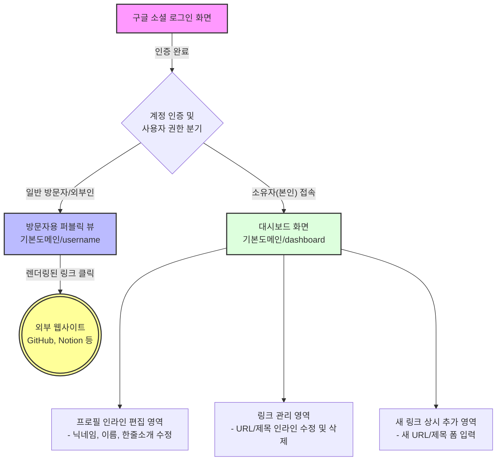

# 마이링크 (MyLink) - 와이어프레임 (Wireframe)

본 문서는 마이링크 서비스의 핵심 화면인 **(1) 방문자용 퍼블릭 화면(Public View)**과 **(2) 관리자(소유자)용 대시보드 화면**에 대한 화면 설계서입니다. 직관적인 이해를 위해 ASCII 아트와 Mermaid 다이어그램을 병행하여 작성되었습니다.

---

## 1. 퍼블릭 화면 (Public View - 방문자가 보는 화면)

방문자가 브라우저에서 `기본도메인/[username]`으로 접속했을 때 보여지는 깔끔하고 모바일 친화적인 화면입니다.

### 1.1 ASCII 아트 와이어프레임

```text
+-------------------------------------------------+
|                                                 |
|               [ 기본도메인/minwoo ]               |
|                                                 |
|-------------------------------------------------|
|                                                 |
|    +---------------------------------------+    |
|    |                                       |    |
|    |      [ minwoo ]                       |    |
|    |      (이   름) 강민우                    |    |
|    |      (소   개) 프론트엔드 개발자입니다.      |    |
|    |                                       |    |
|    +---------------------------------------+    |
|                                                 |
|    +---------------------------------------+    |
|    |  [G]  GitHub 레포지토리 (github.com..)  |    |
|    +---------------------------------------+    |
|                                                 |
|    +---------------------------------------+    |
|    |  [N]  기술 블로그 (velog.io/@minwoo)    |    |
|    +---------------------------------------+    |
|                                                 |
|    +---------------------------------------+    |
|    |  [I]  개인 포트폴리오 (notion.so/..)    |    |
|    +---------------------------------------+    |
|                                                 |
|                  Powered by MyLink              |
+-------------------------------------------------+
```
*(기호 설명: `[G]`, `[N]`, `[I]` 등은 Google Favicon API로 자동 연동되어 해당 사이트의 로고/파비콘이 렌더링된 아이콘 영역입니다.)*

---

## 2. 관리자 대시보드 (Dashboard View - 소유자가 로그인 후 보는 화면)

로그인(Firebase Google Auth) 후 진입하는 마이링크 프로필/링크 관리 페이지입니다. 모든 수정 액션은 화면 전환이나 모달 팝업 없이 텍스트 영역을 클릭하면 즉시 입력창(Input)으로 변환되는 **인라인 편집(Inline Edit)** 방식을 따릅니다.

### 2.1 ASCII 아트 와이어프레임

```text
+-------------------------------------------------+
|  MyLink 대시보드                     [로그아웃]  |
|-------------------------------------------------|
|                                                 |
|  [ 내 프로필 편집 ]                              |
|   닉네임: [ minwoo ✎ ]                           |
|   이  름: [ 강민우   ✎ ]                           |
|   소  개: [ 프론트엔드 개발자입니다. ✎ ]            |
|                                                 |
|-------------------------------------------------|
|                                                 |
|  [ 내 링크 리스트 / 수정 ]                       |
|   +---------------------------------------+     |
|   | URL: [ https://github.com/minwoo ✎ ]  |     |
|   | 제목: [ GitHub 레포지토리 ✎ ]             | [🗑] |
|   +---------------------------------------+     |
|                                                 |
|   +---------------------------------------+     |
|   | URL: [ https://velog.io/@minwoo ✎ ]   |     |
|   | 제목: [ 기술 블로그 ✎ ]                   | [🗑] |
|   +---------------------------------------+     |
|                                                 |
|  [ + 새 링크 추가하기 ]                          |
|   +---------------------------------------+     |
|   | 새 URL 입력: [                        ] |     |
|   | 새 제목 입력: [                        ] |     |
|   |                               [ 등록 ]  |     |
|   +---------------------------------------+     |
|                                                 |
+-------------------------------------------------+
```
*(기호 설명: 텍스트 뒤의 `✎` 표시는 인라인 편집 가능 영역임을 뜻하며 클릭 시 텍스트필드 커서가 활성화됩니다. `[🗑]`는 해당 항목 삭제 버튼입니다.)*

---

## 3. 화면 요소 구조 및 플로우 (Mermaid 다이어그램)

전체 화면들의 기능 연관성과 이동 경로를 추상화한 플로우차트입니다.



---
*문서 버전: 1.0*
*최종 업데이트: 2026-03-27*
